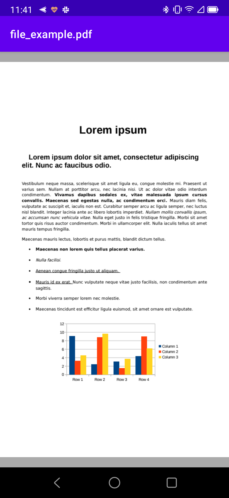

# Pdf-View

## ScreenShots


## Implementation

### build.gradle
```
repositories {
  maven { url "https://jitpack.io" }
}

```
### [module]/build.gradle

```
version latest: 1.0.0-alpha2

dependencies {
  implementation 'com.github.longdt57:Pdf-View:{version}'
}
```

## Usage
### 1. PdfView
```
<lee.module.pdfview.pdf.PdfView
    android:layout_width="match_parent"
    android:layout_height="match_parent" />
```
- Set Data by Uri: `pdfView.setUri(...)`
- Set Data by PdfRenderer: `pdfView.setPdfRenderer(renderer)`

### 2. Open Pdf File
```
// pdf file Uri
val uri = ...

Intent(Intent.ACTION_VIEW).apply {
    val type = "application/pdf"
    setDataAndType(uri, type)
    addFlags(Intent.FLAG_ACTIVITY_CLEAR_TOP)
    startActivity(this)
}
```

## References:
- https://github.com/Baseflow/PhotoView
